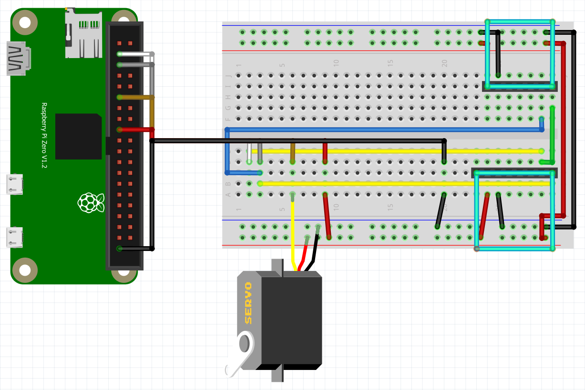

# Pi In the Sky
## Equations
Everyone needs some equations to define various bits 'n pieces. Here are ours:

(number of balloons) = 81.7 * (mass in kilograms)

(ft<sup>3</sup> of helium) = 33 * (mass in kilograms)
## The Build
NEEDS CONTENT
## The Stuff Inside
The house's contents are:
* One (1) Raspberry Pi Zero
* One (1) MPL3115A2 Plus altimeter
* One (1) LSM303DLHC accelerometer
* One (1) Tower Pro SG92R Micro servo
* One (1) 400 Tie Point Solderless Breadboard
* One (1) PowerBost 500 Charger
* One (1) 3.7v lithium ion battery
* One (1) USB OTG MicroB cable
* One (1) MicroSD card
* ~Fifty centimetres (50cm) wire


The wiring is picured above. The cyan rectangles represent the altimeter and accelerometer.

## The Code
<details>
<summary>Our code, completed Feb. 21</summary>
<br>

```python
# Aidan & Cade's UP house code

# Variables to define
autosave = 10 #                            "autosave" defines the amount of time between saves of the file
maxh = 1#                                "maxh" defines the height (in metres) at which the servo will activated
txt = '/home/pi/Documents/Engineering_4_Notebook/piinthesky/Pi_in_the_Sky_Final'+ +'.txt' # "txt" defines the name of the document used to record the data

# Libraries to import
import smbus
import time
import Adafruit_LSM303
import RPi.GPIO as GPIO

# Setup for the accelerometer, servo, and text writer
lsm303 = Adafruit_LSM303.LSM303()
GPIO.setmode(GPIO.BOARD)
GPIO.setup(11,GPIO.OUT)
p = GPIO.PWM(11, 50)
p.start(0)
f = open(str(txt),'r+')

# Allows the components to be used with measurements that can be relied upon and sets the "launch" time
time.sleep(5)
t0 = time.time()

# Get I2C bus
bus = smbus.SMBus(1)

# MPL3115A2 address, 0x60(96)
# Select control register, 0x26(38)
#		0xB9(185)	Active mode, OSR = 128, Altimeter mode
bus.write_byte_data(0x60, 0x26, 0xB9)
# MPL3115A2 address, 0x60(96)
# Select data configuration register, 0x13(19)
#		0x07(07)	Data ready event enabled for altitude, pressure, temperature
bus.write_byte_data(0x60, 0x13, 0x07)
# MPL3115A2 address, 0x60(96)
# Select control register, 0x26(38)
#		0xB9(185)	Active mode, OSR = 128, Altimeter mode
bus.write_byte_data(0x60, 0x26, 0xB9)

time.sleep(1)

# MPL3115A2 address, 0x60(96)
# Read data back from 0x00(00), 6 bytes
# status, tHeight MSB1, tHeight MSB, tHeight LSB, temp MSB, temp LSB
data = bus.read_i2c_block_data(0x60, 0x00, 6)

# Convert the data to 20-bits
tHeight = ((data[1] * 65536) + (data[2] * 256) + (data[3] & 0xF0)) / 16
altitude = tHeight / 16.0

# Sets initial altitude and prints it for debugging
a0 = altitude
print('a0: ' + str(a0) + '\n')

bus.write_byte_data(0x60, 0x26, 0x39)
time.sleep(1)
data = bus.read_i2c_block_data(0x60, 0x00, 4)

while True:
# This loop begins with an exact copy of the altimeter reading
    bus.write_byte_data(0x60, 0x26, 0xB9)
    bus.write_byte_data(0x60, 0x13, 0x07)
    bus.write_byte_data(0x60, 0x26, 0xB9)
    time.sleep(1)
    data = bus.read_i2c_block_data(0x60, 0x00, 6)
    tHeight = ((data[1] * 65536) + (data[2] * 256) + (data[3] & 0xF0)) / 16
    temp = ((data[4] * 256) + (data[5] & 0xF0)) / 16
    altitude = tHeight / 16.0
    cTemp = temp / 16.0
    fTemp = cTemp * 1.8 + 32

# Prints altitude record for debugging and sets the "delta-a", as it were, to the variable "a"
    print('altitude: ' + str(altitude))
    a = altitude - a0
    print('delta-a: ' + str(a))

# Immediately checks to see if the house has reached the max altitude
    if a >= maxh:
        p.ChangeDutyCycle(3) # Moves the servo to release balloons
        time.sleep(3)
        p.ChangeDutyCycle(0)
        p.stop()
        GPIO.cleanup() #       Turns the servo off

# MPL3115A2 address, 0x60(96)
# Select control register, 0x26(38)
#		0x39(57)	Active mode, OSR = 128, Barometer mode
    bus.write_byte_data(0x60, 0x26, 0x39)

    time.sleep(1)

# MPL3115A2 address, 0x60(96)
# Read data back from 0x00(00), 4 bytes
# status, pres MSB1, pres MSB, pres LSB
    data = bus.read_i2c_block_data(0x60, 0x00, 4)

# Convert the data to 20-bits
    pres = ((data[1] * 65536) + (data[2] * 256) + (data[3] & 0xF0)) / 16
    pressure = (pres / 4.0) / 1000.0

# Output data to screen for debugging
#    print("Pressure : %.2f kPa" %pressure)
#    print("Altitude : %.2f m" %a)
#    print("Temperature in Celsius  : %.2f C" %cTemp)
#    print("Temperature in Fahrenheit  : %.2f F" %fTemp)

# Sets the time since "launch" and converts it to hh:mm:ss format
    elapsed = -1*(int(t0) - int(time.time()))
    T = time.strftime('%H:%M:%S', time.gmtime(elapsed))

# Reads the 5accelerometer and formats the data to m/s^2
    accel, mag = lsm303.read()
    accel_x, accel_y, accel_z = accel
    mag_x, mag_y, mag_z = mag
    x = int(accel_x) * (9.81/1024)
    y = int(accel_y) * (9.81/1024)
    z = int(accel_z) * (9.81/1024)
    x = round(x, 3)
    y = round(y, 3)
    z = round(z, 3)

# Creates a special string for the accelerometer data
    accel = ('X: ' + str(x) + '; Y: ' + str(y) + '; Z: ' + str(z))

# Writes the time, altitude, and accelerometer string to the document
    f.seek(0,2)
    f.write('T+ ' + str(T) + '\n')
    f.write('     A+ ' + str(a) + 'm\n')
    f.write('     ' + str(accel) + '\n')

# If the elapsed time is a multiple of the autosave interval
    if elapsed != 0:
        if elapsed % int(autosave) == 0:
            f.close() #                               Closes (saves) document
            f = open(str(txt),'r+') # Re-opens document
```
</details>
## The Schedule
### January
_Day 1 through Day 12_

__January 9 - Day 1__

We began the project early. Because of this, we deviated slightly from the schedule by planning out the size (and ground floor shape) of the house.

__January 10 - Day 2__

We mostly finished the floor plan and decided against including a camera. We also began to mass the necessary components.

__January 13 - Day 3__

We finished the ground floor and began to work on the top floor.

__January 14 - Day 4__

We began to create the actual building (walls, etc.).

__January 16 - Day 5__

We finished the ground floor and began the second floor.

__January 17 - Day 6__

We had a half day, so we weren't able to make much progress on the project.

__January 22 - Day 7__

We finished the second floor and chimney, and began making the roof.

__January 23 - Day 8__

We continued making the roof and began working on the walls for the second story.

__January 24 - Day 9__

We made half of the roof and are a mere five or so parts away from completion of the house.

__January 27 - Day 10__

We finished creating the acual architecture of the house, and have moved on to the code.

__January 28 - Day 11__

We figured out how to control a servo with the Pi, and we began to take the steps necessary to save inputs (the accelerometer data) to a .txt file.

__January 30 - Day 12__

Aidan discovered how to read and write a .txt file, as well as how to save it. He began making test code that would simply write accelerometer data to a .txt file.

### Febuary
_Day 13 through Day --_

__Febuary 3 - Day 13__

Aidan almost finished the test .txt writer.

__Febuary 4 - Day 14__

We finished the writer, and began to learn how to use the altimeter.

__Febuary 6 - Day 15__

We transcribed altimeter code we found on the internet and discovered that we need a special library.

__Febuary 7 - Day 16__

We completed the altimeter code and got it in working order. We have a few goals for the rest of the code: decide the autosave interval; decide the altitude when the project descends; set the altitude to zero on startup; and record the altitude, accelerometer data, and time to a .txt file.

__Febuary 10 - Day 17__

We did all the aformentioned tasks. Great! The one thing we didn't do was connect the servo to the system so that it moves at a specified altitude.

__Febuary 11 - Day 18__

We connected the servo and finished the code! We also commented it and re-arranged the wiring to save space and about 50g.

__Febuary 13 - Day 19__

We spent the day debugging the code, because when the code is finished, it is never actually finished.

__Febuary 14 - Day 20__

Aidan worked on the Fritzing diagram, and Cade continued debugging.

__Febuary 18 - Day 21__

Aidan finished and uploaded the Fritzing while Cade almost finished the debugging.

__Febuary 20 - Day 22__

Aidan encountered issuses with getting the Fritzing to display, while Cade finished debugging the code (hopefully).
